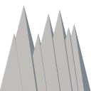
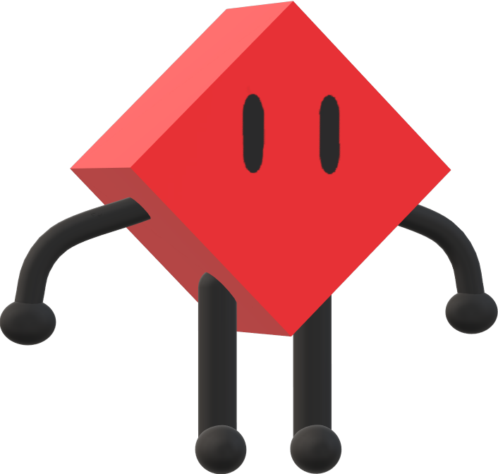

# JeR_Grupo_F

## Nombre_del_Juego
Dual Interest

## Descripcion_del_Juego
*Te interesa colaborar con el enemigo para poder ganar.*

Dual Interests es un videojuego multijugador de plataformas 2D de dos personas con un estilo simplificado en el que cada jugador controla a un personaje y combinando fases cooperativas de puzzles y fases de duelo compiten por la superioridad en una serie de niveles en los que deberán recolectar calaveras que les darán puntos para poder ganar.

## Integrantes
*Rodrigo Garcia Suarez, r.garciasu.2019@alumnos.urjc.es, Rogarsu2014*

*Mariano Jesús De Biase Rodriguez, mj.debiase.2019@alumnos.urjc.es, marianoj27*

*Pablo Pomares Crespo, p.pomaresc.2018@alumnos.urjc.es, A6MFlygon*

*Roberto García Martín, r.garciama.2018@alumnos.urjc.es, drowlerd*

**https://trello.com/b/JyMPz9K5/improvisation-productions**

___
## Propósito y público objetivo

El objetivo de este juego es crear un ambiente divertido en el que los jugadores tengan una experiencia intensa, al mezclar cooperación e interés, donde participen en niveles rápidos con amigos.

El juego está pensado para cualquier tipo de jugador capaz de soportar violencia moderada (14+). Al ser un juego sin trama, no es necesario el entendimiento de una historia, quedando éste reducido a la comprensión de las normas por parte del jugador.

## Jugabilidad 
La jugabilidad de Dual Interests está determinada por varios factores que se mencionan a continuación:

* #### Desplazamiento  y movilidad: 
El movimiento se realiza con las teclas W,A,S,D (para el primer jugador)  y U, H, J, K (para el segundo jugador en local).
* #### Interacción con el oponente: 
Es posible empujar y subirse sobre el oponente para completar el nivel usando el primer jugador la tecla F y el segundo jugador la tecla L.
* #### Escenario: 
El escenario del juego será de estética minimalista y colorida.

## Estilo visual
El estilo visual de Dual Interest es simplificado y colorido, siendo el nivel ilustrado con colores planos y una estética simple y estilizada. Los personajes son seres geométricos, coloridos con estética similar al escenario.

*Imagen de fondo del menú principal*

*SpriteSheet de la calavera*

## Alcance
La prioridad se centrará en ofrecer al jugador suficiente variedad de mapas y de objetos en la versión base para que la experiencia sea lo más innovadora posible. 
De cara al futuro se añadirán nuevos mapas y objetos, ofreciendo así variedad al jugador y mecánicas (agarrar, agacharse, entre otras) para que los nuevos contenidos y los previos puedan experimentarse de diferentes maneras.

# Mecánicas de juego 
Aquí se hablará más en profundidad de las mecánicas y funcionamiento de las mismas en Dual Interest. Principalmente nos centraremos en ampliar los conceptos que ya han sido introducidos previamente y expandirlos con el fin de que se comprenda mejor su estructura. 

## Jugabilidad

### Niveles
Los jugadores tendrán que superar un total de 3 rondas de 2 niveles, uno cooperativo y uno competitivo. Los niveles tendrán unos momentos en el que ambos jugadores cooperarán para poder acceder a la siguiente fase, en la que competirán entre ellos para ganar puntos.
### Fase de cooperación
En esta fase deberán ayudarse ambos oponentes para poder desbloquear el mapa y llegar a la salida. Habrá un puzzle que tienen que resolver, compuesto por una serie de botones que hay que pulsar en un orden determinado y por un jugador determinado. Este jugador se puede deducir ya que el color del botón es el mismo que el del jugador.

### Funcionamiento del nivel
- En cada nivel, los jugadores tendrán que completar tareas (pulsación de botones) para ayudarse entre ellos y poder avanzar en el nivel. 
- Si un jugador no completa la tarea, es decir, no está cooperando, se verá penalizado. 
Cada jugador tiene el mismo número de tareas que completar.
Hay cierto tiempo para completar los niveles, cuando se completa una tarea, se añade tiempo extra al contador (suma de 5 segundos).

### Tareas
Una tarea puede ser varias cosas:
- Pulsar un botón.
- Ser el soporte para que el otro jugador salte más alto (se sobreentiende que al ser botón pulsado por el otro jugador este ha sido ayudado y se recompensa a los dos).

### Recompensas
- Cada vez que un jugador completa una tarea, se le dará puntos como recompensa.
- Si un jugador no completa una tarea, se le restará 100 puntos. 

### Fase de competición 
El siguiente paso para el jugador será competir y conseguir más puntos que el otro, a la vez que impedirle obtener puntos mediante métodos como el empuje, que se tratará más adelante. Estos niveles a veces son algo más grandes que los niveles de cooperación y se extienden en una dirección concreta: vertical u horizontal. Los verticales de momento no modifican el tamaño de la pantalla. Ambos tipos de mapas tienen calaveras repartidas por su escenario donde ambos jugadores compiten por ver quien es el que consigue más calaveras. 

En los niveles horizontales, los jugadores tendrán que tener cuidado con trampas que les complican esta tarea, mientras que en los niveles verticales, el impedimento será la habilidad del jugador haciendo saltos por las plataformas.

## Puntos
Se otorgarán puntos a los jugadores al recolectar calaveras y colaborar con el jugador (en este último caso se refiere a la fase de colaboración, y en esta los puntos son directamente sumados). Estos puntos serán el principal indicador de victoria para cada partida. Dichos puntos se guardarán a lo largo de la partida, compuesta por varias rondas. La cantidad de puntos ganados por la recolección de calaveras y acciones cooperativas serán constantes.
Por otra parte la cantidad de puntos perdidos es distinta, ya que las trampas restan 50 puntos mientras que no completar una tarea cooperativa resta 100 puntos. Cabe destacar el hecho de que el número de calaveras durante la fase de competición va a ser impar, de manera que se intente que no haya empates durante esta fase, sino que haya un ganador por poco que sea.

## Salto
La mecánica del salto está pensada de forma que de juego a un desplazamiento entre plataformas y hacia ellas de manera eficiente y rápida. Está pensado de forma que la distancia de salto sea constante, sin depender de la fuerza con la que se presiona la tecla o el tiempo pulsado. Asimismo el salto puede ser sobre otro jugador, lo cual está pensado tanto para las fases de cooperación como las de competición.

## Empuje
El empuje está diseñado como una mecánica de competición, cuyo propósito es el impedimento o la obstaculización de las acciones del oponente. Sin embargo esta acción estará disponible también en la fase de cooperación, con el fin de que si lo ven necesario los jugadores hagan uso de ella. Al igual que con el salto, el empuje desplazará al oponente una distancia determinada y constante.

## Desplazamiento lateral
El jugador podrá desplazarse en un solo plano, pudiendo moverse a lo ancho (eje horizontal) y a lo alto (eje vertical) mediante el uso de las mecánicas de movimiento previamente definidas y elementos del escenario.

## Trampas 
Las trampas son mecanismos presentes en el escenario que dificultan el avance  a los jugadores durante la fase de competición. Las trampas actuales están representadas mediante unos pinchos rocosos que salen del suelo. Estas trampas al caer sobre ellas hacen que el jugador reaparezca en la posición inicial del nivel y se le restan 50 puntos. Además el jugador se queda inmovilizado durante 2 segundos como penalización.

*Sprite de la trampa*

## Tiempos
Los jugadores tendrán un límite de tiempo para completar los diferentes objetivos. Hay un tiempo para las tareas en la fase cooperativa, y otro para la fase competitiva. El contador se encontrará centrado en la parte superior de la pantalla. Se les dará a los jugadores 15 segundos o menos en la fase de cooperación para realizar sus tareas y se otorgará una bonificación de tiempo cuando un jugador complete una. Para la fase competitiva los jugadores tendrán aproximadamente 30 segundos para superar los obstáculos, luchar y avanzar hacia los puntos.

## Personaje
Los personajes presentes en el juego son controlados por los jugadores, sin NPC’s al ser el juego exclusivamente multijugador. Dichos personajes tienen una complexión pequeña y ágil acorde con el espíritu frenético del juego, además de que un tamaño grande sería una molestia a la hora de desplazarse. 

En cuanto al aspecto físico se distinguen dos personajes geométricos diferenciables. Ambos con formas distintas y brazos, piernas y ojos.

*Primeros Diseños de personaje*

*Hojas de Sprite de los personajes*

# Movimiento y físicas 
## Colisiones

Las colisiones producidas son:

- Jugador - Escenario
- Jugador - Trampa
- Jugador - Jugador
- Jugador - Calavera (puntos)

Cada escenario contará con paredes y plataformas que tendrán colisión con el jugador.
Los jugadores entre sí también tendrán colisión.
Por otro lado, las calaveras podrán ser tocadas por los jugadores para ser obtenidas. Una vez obtenidas, desaparecerán.

## Controles 
El control de movimiento se realiza con el teclado. El desplazamiento lateral se realizará con las teclas A y D para moverse a izquierda y derecha respectivamente. El movimiento de salto se realizará con la tecla W. Se encuentra la opción de acelerar la caída usando el botón S.
El empuje será realizado con la tecla F, empujando y desplazando al jugador rival hacia donde el jugador que empuja está mirando. En teclado, el segundo jugador se moverá con H y K a izquierda y derecha, saltará con la U, descenderá con la J y empujará con la L

